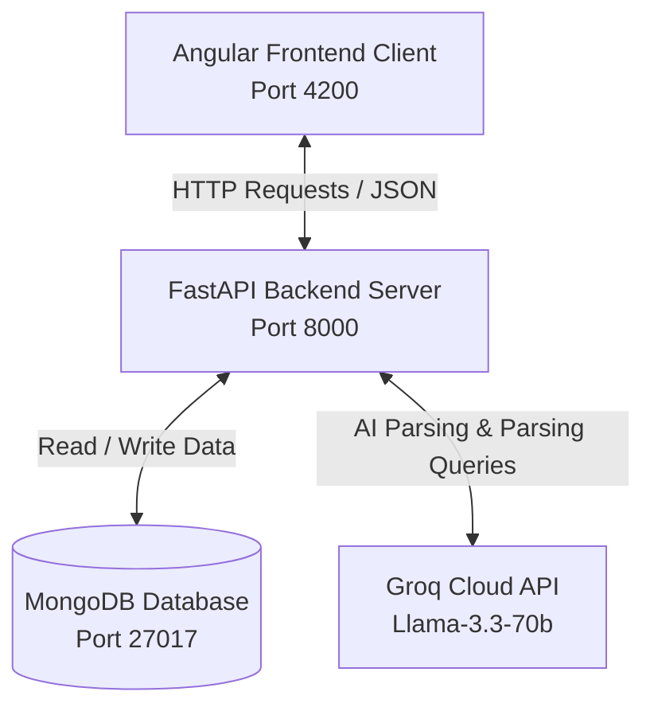

# Candidate Search Platform - Architecture & Code Walkthrough

This document outlines the system architecture and explains the backend codebase of the Candidate Search Platform.

---

## 1. Running Project Links

*   **Frontend Application (Angular):** [http://localhost:4200/](http://localhost:4200/)
*   **Backend Server (FastAPI):** [http://127.0.0.1:8000/](http://127.0.0.1:8000/)
*   **Backend Interactive API Docs (Swagger UI):** [http://127.0.0.1:8000/docs](http://127.0.0.1:8000/docs)

---

## 2. System Architecture

The platform uses a modern three-tier architecture:

1.  **Frontend (Client Layer):**
    *   Built with **Angular 18** and **Angular Material** for a responsive, modern UI.
    *   Uses **Three.js** and **GSAP** in [three-bg.component.ts](file:///c:/Users/hasna/Downloads/project%20phase%201/project%20phase%201/project%20phase%201/frontend/src/app/three-bg.component.ts) to create interactive 3D background visual effects.
    *   Uses [api.service.ts](file:///c:/Users/hasna/Downloads/project%20phase%201/project%20phase%201/project%20phase%201/frontend/src/app/api.service.ts) to send file uploads, query searches, and update candidate records on the backend.
2.  **Backend (Application & Logic Layer):**
    *   Powered by **FastAPI** (Python) in [main.py](file:///c:/Users/hasna/Downloads/project%20phase%201/project%20phase%201/project%20phase%201/main.py).
    *   Handles file uploads, text extraction from PDF/DOCX, and runs candidate-ranking algorithms.
    *   Integrates with the **Groq API** (using Llama-3.3-70b-versatile model) to intelligently parse resumes and search queries.
3.  **Database (Data Storage Layer):**
    *   Uses **MongoDB** (configured via [config.py](file:///c:/Users/hasna/Downloads/project%20phase%201/project%20phase%201/project%20phase%201/config.py) and [.env](file:///c:/Users/hasna/Downloads/project%20phase%201/project%20phase%201/project%20phase%201/.env)) to store candidate profiles, resume text, file hashes (for deduplication), and search query histories.

---

## 3. Explanation of `main.py` and How It Works

The [main.py](file:///c:/Users/hasna/Downloads/project%20phase%201/project%20phase%201/project%20phase%201/main.py) program is the heart of the backend. It handles all business logic, routing, and DB/AI integrations. Here is the breakdown:

### A. Initializing FastAPI & Middleware (Lines 25–45)
*   It sets up the `FastAPI` application instance.
*   It applies **CORS (Cross-Origin Resource Sharing)** middleware so the Angular frontend (running on port `4200` or `4201`) can make secure requests to the backend API (running on port `8000`).

### B. DB Connections & Models (Lines 48–75)
*   It uses `pymongo` to connect to MongoDB and initializes three collections:
    *   `resumes` (or `candidates` collection name) to store candidate profiles.
    *   `search_history` to log user searches.
*   **Pydantic Models** ([SearchRequest](file:///c:/Users/hasna/Downloads/project%20phase%201/project%20phase%201/project%20phase%201/main.py#L50), [BotSearchRequest](file:///c:/Users/hasna/Downloads/project%20phase%201/project%20phase%201/project%20phase%201/main.py#L54), [UpdateCandidateRequest](file:///c:/Users/hasna/Downloads/project%20phase%201/project%20phase%201/project%20phase%201/main.py#L60)) validate inputs sent by the frontend client.

### C. AI Integration with Groq (Lines 77–176)
*   Initializes the `Groq` client using the API key loaded from [.env](file:///c:/Users/hasna/Downloads/project%20phase%201/project%20phase%201/project%20phase%201/.env).
*   Defines three major LLM prompts:
    1.  `QUERY_PARSING_PROMPT`: Instructs the LLM to parse natural language queries (e.g., *"fresher react developer"*) and output clean filters (skills, experience, keywords) in JSON format.
    2.  `EXTRACTION_PROMPT`: Instructs the LLM to extract structured fields (Name, Age, Experience, Skills, Roles) from raw resume text.
    3.  `JOB_RECOMMENDATION_PROMPT`: Directs the LLM to suggest 5 relevant target job titles for a candidate's profile.

### D. Core Processing & Business Logic Helpers (Lines 178–375)
*   [extract_text_from_upload()](file:///c:/Users/hasna/Downloads/project%20phase%201/project%20phase%201/project%20phase%201/main.py#L213): Reads uploaded files and converts PDF (using `pypdf`), DOCX (using `docx`), or TXT content into a single plain-text string.
*   [check_duplicate()](file:///c:/Users/hasna/Downloads/project%20phase%201/project%20phase%201/project%20phase%201/main.py#L368): Calculates the **SHA-256 hash** of the uploaded file bytes. It checks if the hash already exists in MongoDB, preventing duplicate resume uploads.
*   [rank_candidates()](file:///c:/Users/hasna/Downloads/project%20phase%201/project%20phase%201/project%20phase%201/main.py#L316): Compares candidates' profiles against search criteria. It scores each candidate:
    *   **+5 points** per matched technical skill.
    *   **+3 points** for satisfying minimum experience requirements.
    *   **-2 points** for having insufficient experience.
    *   **+1 point** for keyword matches in names or roles.
    *   Returns the sorted list of candidates based on their scores.

### E. API Routes (Endpoints) (Lines 378–683)
*   **Upload Resume (`POST /resume/upload`):** 
    1. Checks for file type (PDF, DOCX, TXT) and duplicate files.
    2. Extracts plain text.
    3. Sends text to Groq (`ai_extract_resume`) to parse structure.
    4. Requests job recommendations (`ai_recommend_jobs`).
    5. Saves the profile to MongoDB and returns it.
*   **Search (`POST /search` & `POST /search/bot`):**
    *   `/search` parses search terms with static regex rules.
    *   `/search/bot` utilizes the LLM (`ai_parse_query`) to understand complex queries like *"Need a senior django dev with 5 years experience"* and returns AI-ranked matches. Logs searches to the query history.
*   **Search History (`GET & DELETE /search/history`):** Lets users fetch recent queries and results, or clear the search database.
*   **Candidate CRUD (`GET /resumes`, `GET /resume/{id}`, `PATCH /resume/{id}`, `DELETE /resume/{id}`):** Manages candidate listings, updates editable fields (like correcting extracted names/skills), and handles deletion.
*   **refresh_recommendations (`GET /resume/{id}/recommend`):** Requests updated job recommendation strings from Groq.
*   **export_candidates_csv (`GET /export/candidates`):** Fetches candidate documents from MongoDB, structures them, and streams a downloadable `.csv` file back to the browser.
